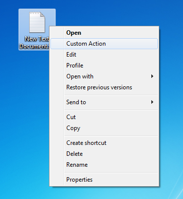
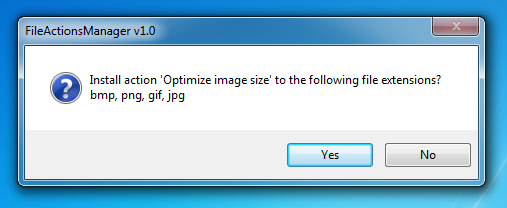

# FileActionsManager

This program allows to create context menu actions in the Windows file explorer using configuration files.



The main purpose of FileActionsManager is to allow easy installation of the action and associated standalone program, if any, on several machines. If you are looking to manually configure file type actions using a nice GUI, see [FileTypesMan](https://www.nirsoft.net/utils/file_types_manager.html) from Nirsoft instead.

## How to use

### General use

When opening a configuration file with FileActionsManager, the program will offer to register the provided context menu action, or unregister it if the action is already registered.



Otherwise, FileActionsManager offers to associate or unassociate itself with `.seinf` files. 

### Configuration file syntax

FileActionsManager works using [INI](https://en.wikipedia.org/wiki/INI_file) files with the `.seinf` file extension.
The following example creates an action to optimize various image formats with [RIOT](http://luci.criosweb.ro/riot/).

````ini
[ShellExtension]
Ext=bmp,png,gif,jpg
Name=optimizeimagesize
DisplayName=Optimize image size
Command=Riot.exe "%1"
Requires=Riot.exe,FreeImage.dll
Default=false
````

Each field has the following purpose:

 - `Ext`: A list of comma-separated file extensions for which the action needs to be created.
 - `Name`: Internal name of the action, must be unique to avoid overwriting another action.
 - `DisplayName`: The label displayed in file context menu inside Windows Explorer.
 - `Command`: The command associated with the action, as typed in `cmd.exe` for instance.
 - `Requires`: _Optional_. Files required for the action to work. See below for details.
 - `Default`: _Optional_. Defines whether the action will become the default action (default: `false`).

**Remark:** Some built-in file types in Windows do not have a default action set. Adding a new non-default action to such a file type may make it appear as default since Windows will pick the first action as default when no default action was specified in registry. As a workaround, you can use an action name like `zzmyaction`.

### Providing additional files with `Requires`

When using the `Requires` feature, FileActionsManager will look for the required files in the same directory as your `.seinf` file. For instance, the following architecture is valid:

````
OptimizeImages
 |- OptimizeImages.seinf
 |- FreeImage.dll
 `- Riot.exe
````

When opening `OptimizeImages.seinf`, FileActionsManager will copy `FreeImage.dll` and `Riot.exe` to ``%appdata%\ShellExtensions``. Furthermore, the `Command` will be adapted to the full path to `Riot.exe` before being set in registry.

It is possible to share the same executable between two actions, for instance it is possible to provide `ffmpeg.exe` with both `ConvertMP3.seinf` and `ConvertAAC.seinf`. `ffmpeg.exe` will be stored in `%appdata%\ShellExtensions`, keeping track of which actions depends on `ffmpeg.exe`. The executable will be deleted only when the last action requiring it is removed.

Different executables or libraries with the same name are not handled since only one version is stored.

### Command-line usage

Alternatively to configuration files, FileActionsConsole can be used to register and remove file actions:

````
:: Usage
FileActionsConsole.exe add <extension(s)> <internal name> <display name> <command> [default=false]
FileActionsConsole.exe del <extension(s)> <internal name>
````

````
:: Example
FileActionsConsole.exe add bmp,png,gif,jpg optimizeimagesize "Optimize image size" "Riot.exe "%1""
FileActionsConsole.exe del bmp,png,gif,jpg optimizeimagesize
````

The command-line utility does not support additional files, you'll have to install them by other means.
If you do not need FileActionsConsole.exe, you can safely delete it as it is fully independent from FileActionsManager.exe

## How it works

### File types in the Windows registry

FileActionsManager works by manipulating software classes defined in registry with the Registry editor. These are stored in two places:

 - System-wide file types are defined in `HKEY_CLASSES_ROOT`
 - Users-defined file types are defined in `HKEY_CURRENT_USER\Software\Classes`

As user-defined file types will override system-wide file types, FileActionsManager will copy file type information to the current user section of the registry when installing a new context menu action. This way, no administrator privileges are required since only the `HKEY_CURRENT_USER` section of the registry is opened for writing.

See [How to add context menu item to Windows Explorer](https://stackoverflow.com/questions/20449316/how-add-context-menu-item-to-windows-explorer-for-folders) for more details.

### Additional dependencies

When specifying a dependency with`Requires`, FileActionsManager will copy the file in the Application Data folder of the current user: ``%appdata%\ShellExtensions``.

A file called `deps.ini` is used to track dependencies. This INI file contains a reverse index of actions for each file present in the directory. When the last action item is removed, the file is deleted.

````ini
[Dependencies]
Ffmpeg.exe=aacconvert,mp3convert
Riot.exe=optimizeimagesize
Freeimage.dll=optimizeimagesize
````

## Credits

The following icons are used within FileActionsManager:

 - Buuf icons by Mattahan: [Text Editor icon](http://www.iconarchive.com/show/buuf-icons-by-mattahan/MDI-Text-Editor-icon.html)
 - Buuf icons by Mattahan: [Menu icon](http://www.iconarchive.com/show/buuf-icons-by-mattahan/Menu-icon.html)

These icons are licensed under [CC Attribution-Noncommercial-Share Alike 4.0](http://creativecommons.org/licenses/by-nc-sa/4.0/).

## License

FileActionsManager is provided under [CDDL-1.0](http://opensource.org/licenses/CDDL-1.0) ([Why?](http://qstuff.blogspot.fr/2007/04/why-cddl.html)).

Basically, you can use it or its source for any project, free or commercial, but if you improve it or fix issues,
the license requires you to contribute back by submitting a pull request with your improved version of the code.
Also, credit must be given to the original project, and license notices may not be removed from the code.
